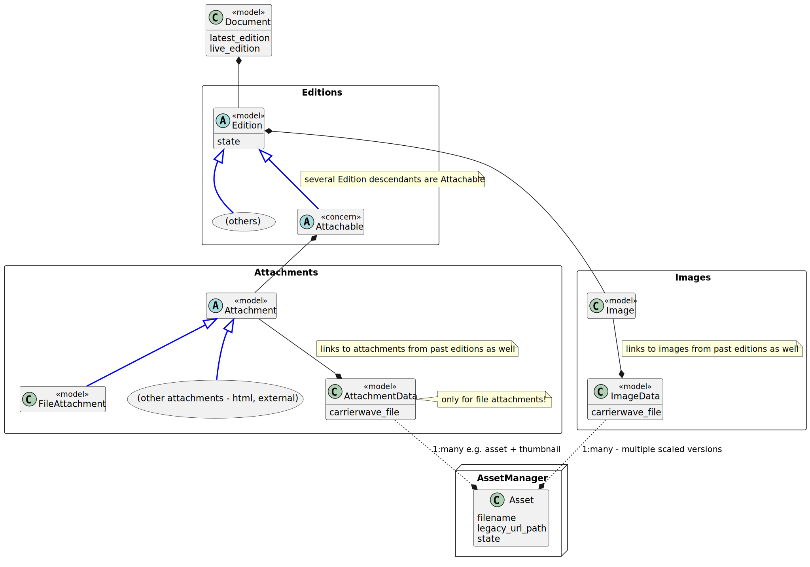
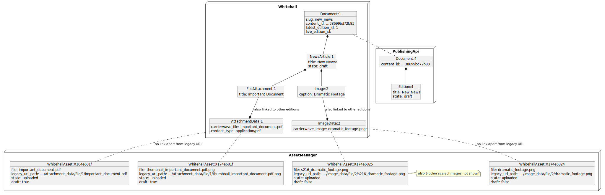
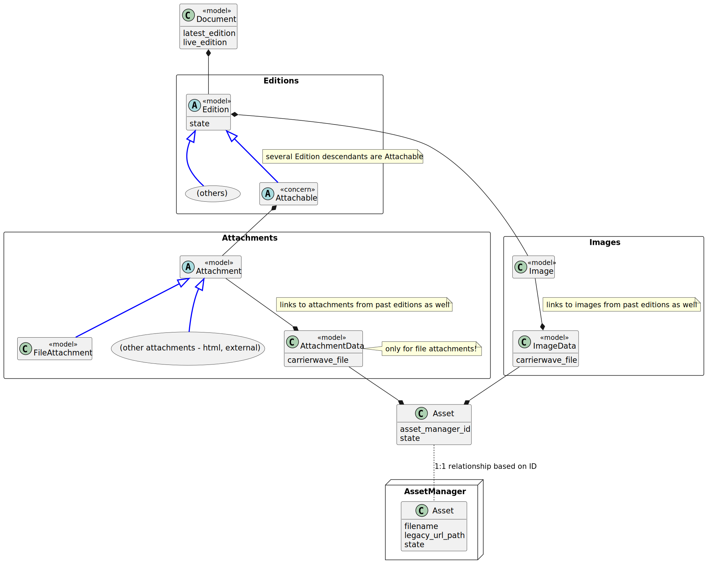
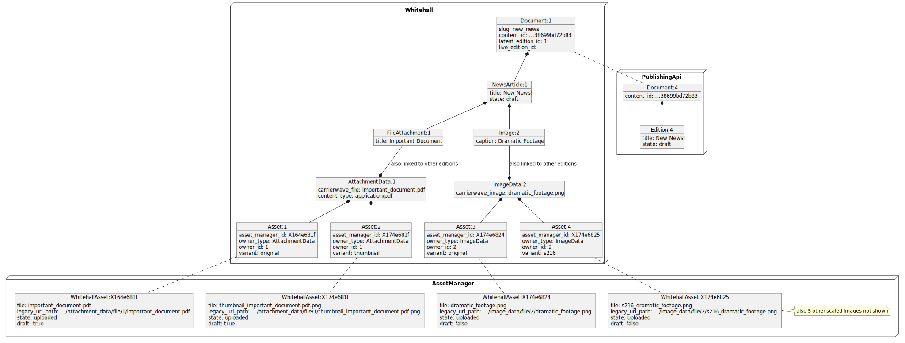

# 2. New Asset Model

Date: 2023-06-20

## Context

Whitehall currently has a messy relationship between its representation of assets - user uploaded files and images - 
and the related assets in Asset Manager.

The current code has a few issues:

- It is a complex structure which is hard for developers to understand, maintain, and improve
- It is linked to legacy Asset Manager behaviour which we'd like to retire
- There is no way to track the state of an individual asset in Whitehall, making it hard to manage the overall state
of an Edition and all of it's assets.

### Existing model

The existing asset model primarily uses `AttachmentData` and `ImageData` objects to store data about uploaded files.  There are also various other assets, such as logos, but we are mostly focused on Attachments and Images here:

The relationship between the Whitehall models `AttachmentData` and `ImageData`, and the actual assets in Asset Manager, is purely defined
in code (and not in an obvious way).

For instance, a single image in whitehall might be stored as an ImageData
with filename `foo.png` and ID `12345` - this is uploaded to the Asset Manager as 6 different Assets, one main one with
a legacy_url_path `/government/uploads/system/uploads/image_data/file/12345/foo.png` -
but also 5 other Assets with paths for different resolutions, 
e.g. a 712x480 image will exist with legacy_url_path `/government/uploads/system/uploads/image_data/file/12345/s712_foo.png`

The only way for Whitehall to find these images is to recreate all 6 legacy URL paths and then query the Asset Manager by path.

This diagram shows a sample scenario of a NewsArticle with one File and one Image attachment:

**NOTE** that other images or assets in Whitehall have similar relationships, not shown here.

## Decision

We plan to move to a more explicit model where all Whitehall Assets in AssetManager have a corresponding `Asset` in Whitehall.

This `Asset` will include the ID of the corresponding Asset Manager `Asset`, the `variant` (e.g. if they are a thumbnail or a scaled image) and a polymorphic relationship to their owning class (this may be in future modeled as a concern such as `AssetOwner` but we will only need that if there is shared behaviour)

Other metadata and state
information can be added to Assets as needed. (Specifics of states to use are not covered in this ADR)

### New model

This is the new asset model:

The scenario shown above would now be modeled as follows:

### State Management

Specifics of state management are not covered by this ADR - they will need to be worked out iteratively
as code is developed to make Whitehall states more robust.

It is likely that Asset state will be more focused on the state of uploading or modifying assets, rather than mirroring Asset Manager's states.

## Status

Draft

## Consequences

### Benefits

- Enables removal of legacy Whitehall behaviour from Asset Manager
- Enables better management of Asset-related Edition states in Whitehall
- Allows for refactoring of opaque code relating to CarrierWave and legacy URL paths

### Issues

- There is some concern about where the "Source of Truth" is now, between Whitehall and Asset Manager. We will need
to be careful to handle scenarios where Whitehall's view of assets does not match Asset Manager's view of assets.
- We need to identify all the parts of Whitehall that need to link to Assets, as well as just the Editions.
