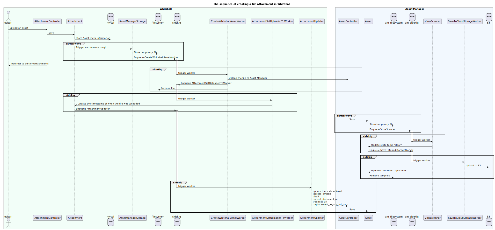
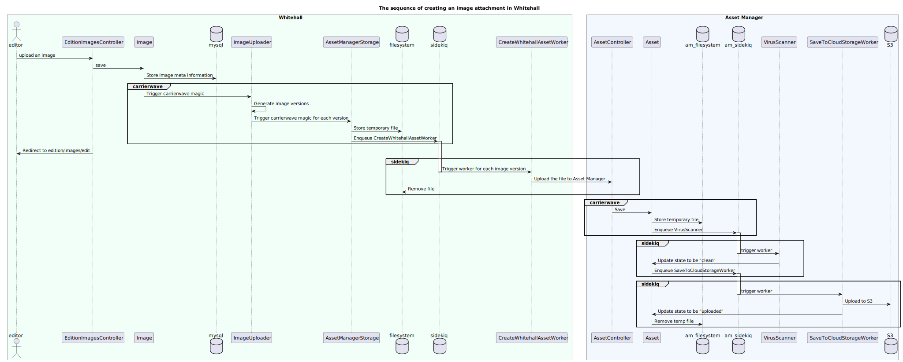
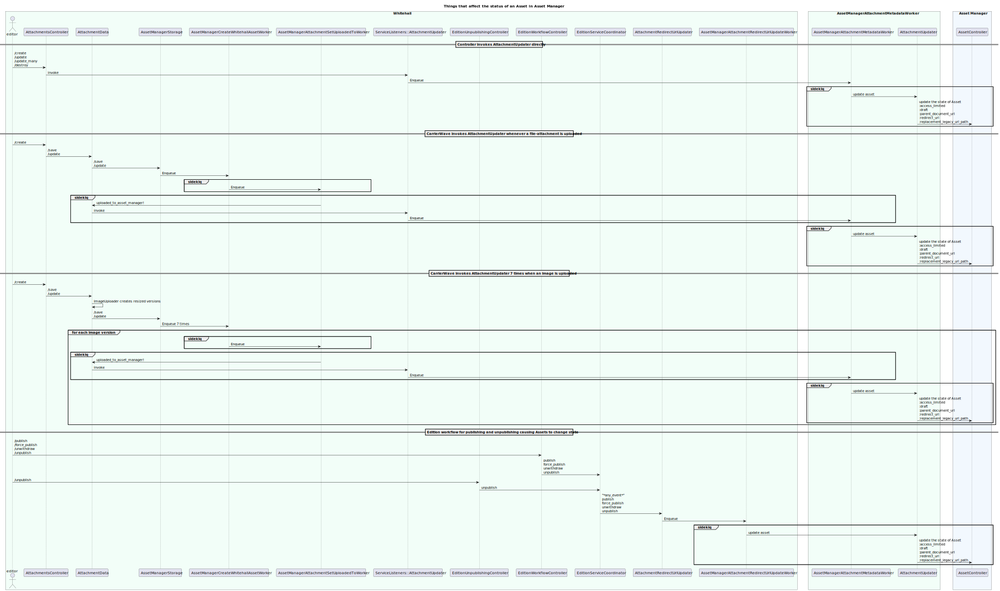
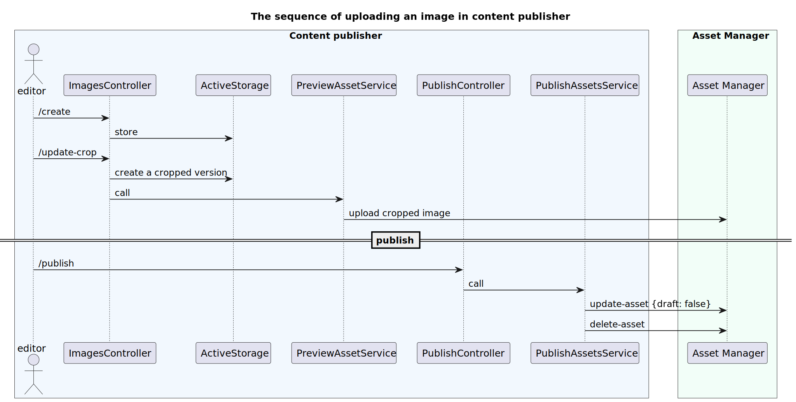

# Asset management sequence diagrams

The following sequence diagrams show the low-level behaviour of Whitehall when performing asset management related activities:

## Uploading an asset

## Uploading an image

## Publishing with assets

## Content publisher image upload

For comparison, this is how Content Publisher uploads images:

