# Existing Asset state change Scenarios

The "state" of Whitehall editions, and their related assets, is complex and not always well reflected by the actual model.

This document walks through some simplified scenarios to show the current (Jun 2023) states of Whitehall models during common asset activities.

One of the goals of the Whitehall Asset Management team is to make these states more explicit, and more robust in the face of distributed system errors.

---
## Scenario 1 - creating a News Article with attachments

### State 1 - draft created

Note there are prior states not shown here around creating the first draft in the Publishing API. However this behaviour is currently synchronous so while it could have problems if the publishing API crashed during a call, it is an unlikely point of failure.

### State 2 - upload file attachment started

A user has attached a file, but the background sidekiq job has not yet uploaded the asset to Asset Manager.  However the original transaction will have committed, so the `FileAttachment` and `AttachmentData` models will be created (and for robustness, would need handling if Asset Manager upload failed)

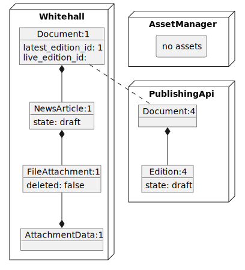

### State 3 - files uploaded to Asset Manager

The sidekiq jobs send the file (plus a thumbnail, in this case) to Asset Manager - it has its own background virus scanner but this shouldn't affect the Whitehall state

Note there are actually a few possible states here as each upload is a separate background job in its own transaction.  **Check this?**

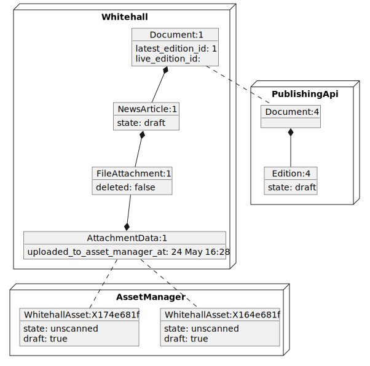

### State 4 - uploading images

A user attaches an image to the article, but the background sidekiq job has not yet started.

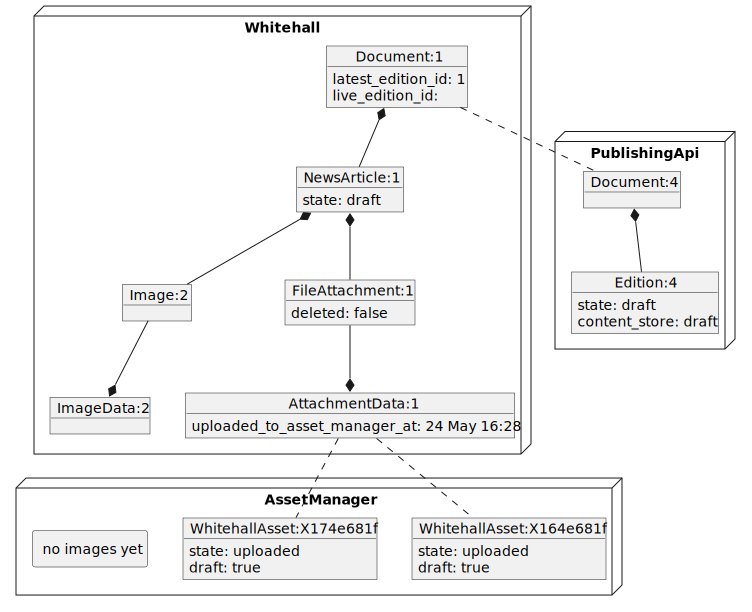

### State 5 - images uploaded to Asset Manager

The sidekiq jobs send several scaled versions of the image to Asset Manager.

Note that there are several possible states here as each upload is a separate background job in its own transaction.

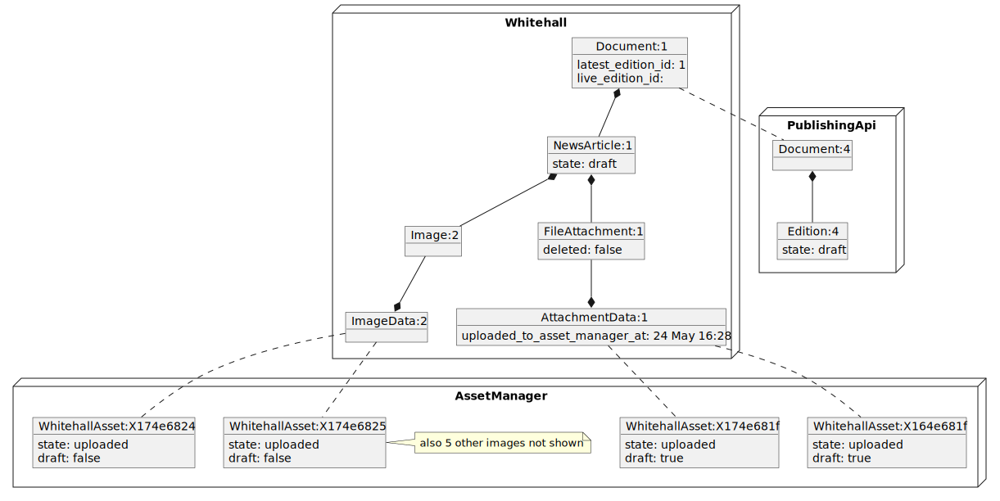

---

## Scenario 2 - publishing the News Article

This starts with state following on from State 5 above

### State 6 - force publishing

The user performs a "Force Publish" (to simplify state - normal publishing flow has several intermediate states) - but the background sidekiq job has not yet started.

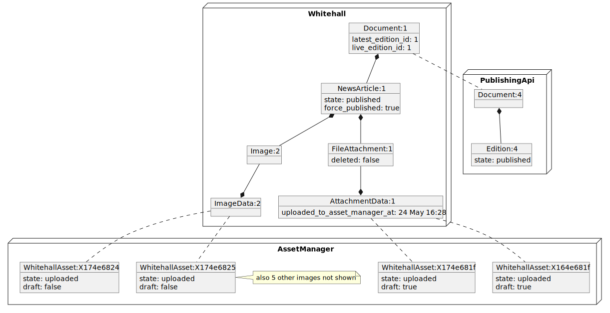

### State 7 - assets updated after publishing

Sidekiq updates the assets asynchronously, each one in its own transaction. **Check**

Note that this only changes files to non-draft - images start as non-draft for some reason!

---

## Scenario 3 - superceding the News Article

This starts with state following on from State 7 above

*Note* for simplicity, this scenario does not show intermediate states when waiting for sidekiq jobs.

### State 8 - user creates a new draft

The new draft causes a new Edition (in this case a News Article) to be created in draft mode, but the old Edition is still live.

Note that the `AttachmentData` and `ImageData` classes are now associated with two FileAttachments and Images respectively.  AttachmentData has some complicated logic such as the `last_publicly_visible_attachment` method that works out which looks at all associated FileAttachments and works out which one is 'live' based on the Edition states.

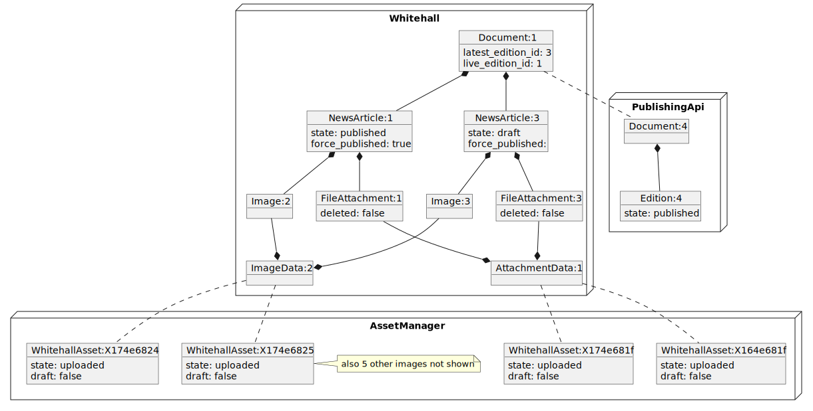

### State 9 - new draft is saved

At this point the draft is sent to the Publishing API.

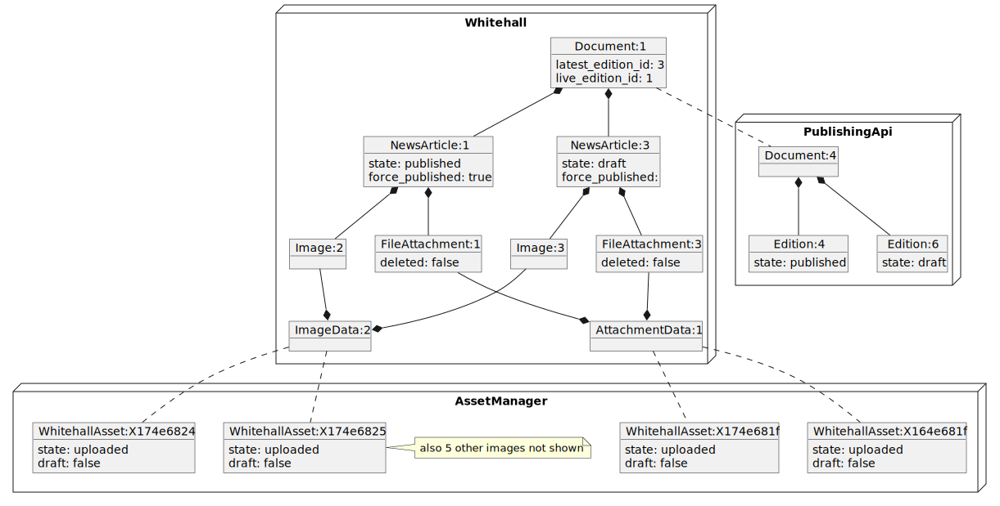

### State 10 - new draft is published

Using Force Publishing again to simplify state flow.  When the new edition is published, the old edition moves to state `superseded` in both Whitehall and Publishing API.

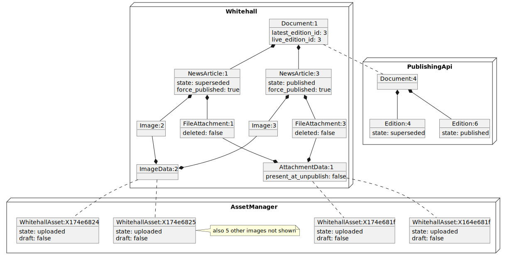

---

## Scenario 4 - deleting unpublished draft

This scenario shows what happens when a draft Edition is created and deleted without ever being published.

### State 1 - new draft

As earlier, a draft is created with images and file attachments:

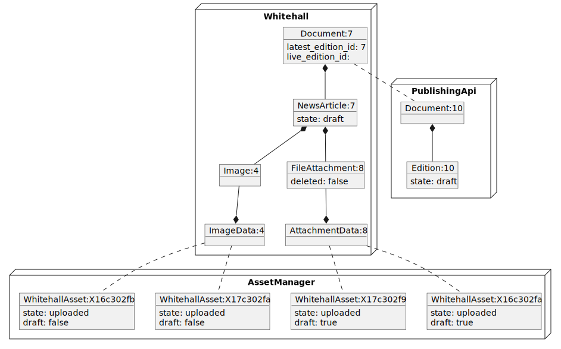

### State 2 - draft deleted

When the draft is deleted, the article and file attachments are soft deleted.  The ImageData and AttachmentData records are not.

The Images are not deleted, they are just orphaned.

In the Publishing API the Edition  is hard deleted.

In the Asset Manager the File assets are soft deleted, the Image assets are not.

Note that soft deletion in Whitehall uses `default scope` which makes the orphaned data effectively inaccessible. 

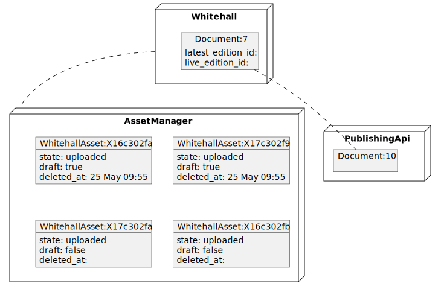

---

## Scenario 5 - deleting published article

Once an article is actually published you can't delete it - you can just unpublish it, which replaces it with a new draft

### State 1 - new draft

### State 2 - article published

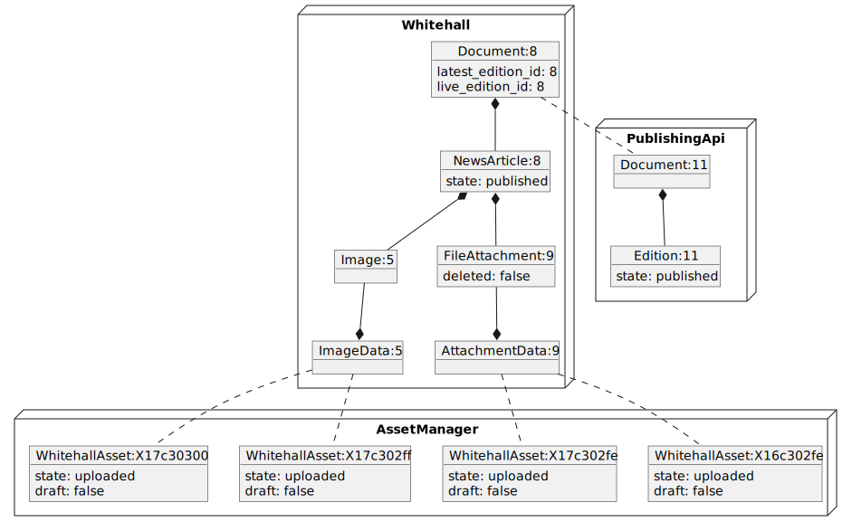

### State 3 - article deleted

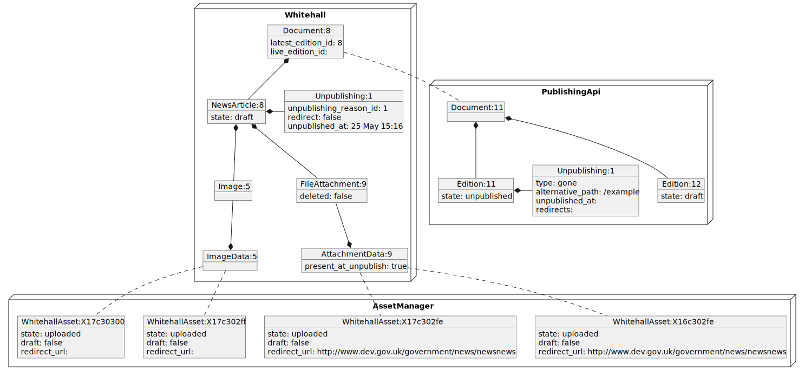
