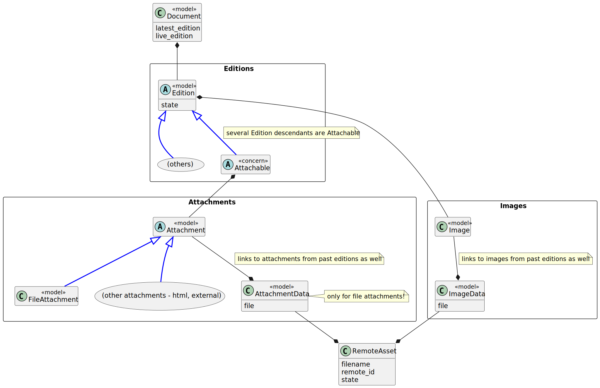
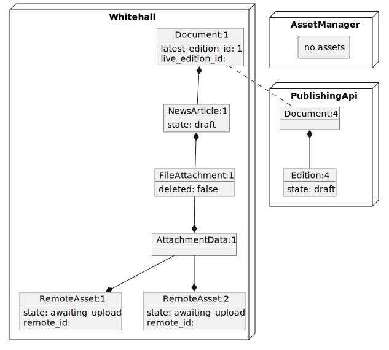
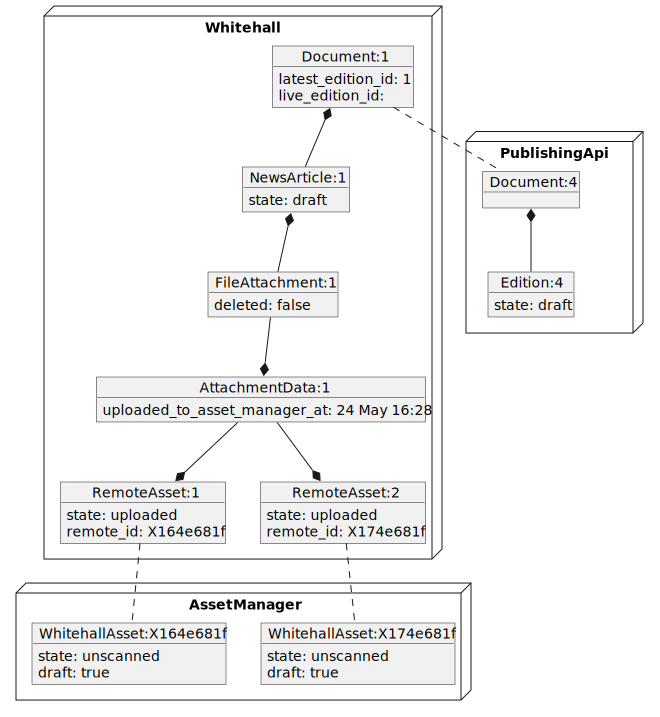

# Request for Comments - new Asset model

This is a document to kick off discussion around changing the Asset modelling in whitehall.

**NOTE** - this is duplicated in Google Drive for collaboration - if you want to make comments or changes, we suggest you make them [here](https://docs.google.com/document/d/1YLsnqhu0BNNCnHJa62yHr_BbyYJS8pIWTRFZKcIezwI/edit?usp=sharing) (cabinet office account needed) - accepted changes should be merged back into github.

## Problem statement

TODO add details

## Proposal

Add an Asset model to track documents in Asset Management, with per-asset state.

Moving from the existing [asset model](edition_asset_model.md) to one including an explicit RemoteAsset model:

### Example - uploading file attachments

The existing [sequence for uploading assets](existing_asset_state_change_scenarios.md) would look similar to:

#### State 2 - Upload file attachment started

When the sidekiq jobs are queued, within the original "upload" transaction, new RemoteAsset entities are created for each asset:

#### State 3 - Upload successful

When the sidekiq jobs are completed, the new RemoteAsset entities are updated to reflect the new state and new asset IDs:

### Blocking unsafe changes

One possibility here, now we can distinguish between "awaiting upload" and "all uploaded", is to stop unsafe state changes.

For example, if a user tries to force publish the above News Article before the assets have been uploaded, we could present them with an error "Not all assets have been uploaded, please try later".

This would help us avoid at least one failure scenario

## Benefits

- solves at least some robustness situations
- makes state explicit, allowing more robusteness improvements
- in future, this makes it easier for files to be owned by Whitehall

## Problems

- Where is the 'source of truth' now?  Are we duplicating a lot of asset management?
- How do we handle when information is out of sync?
- How would we make this change incrementally?

## Still to think through

- naming!
- what are useful states?
- do we want to also track when the state changed, or in some other way be able to tell "this upload was queued 2 hours ago" for error handling
