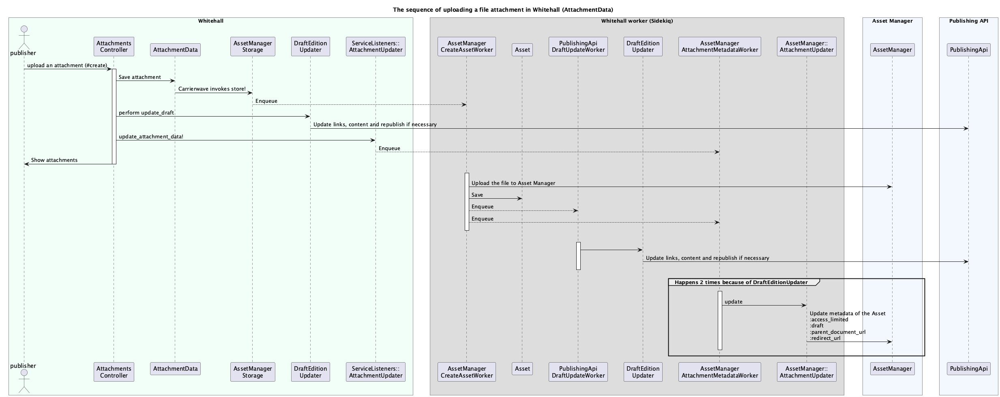

# Asset Management in Whitehall

*Assets, Attachments, Images, Logos, Featured Image, Lead Image, Response Form*

# What it is

There are several document types in Whitehall that utilize Images or
File Attachments.

For example, **News Articles** can have a list of attachments that
provide further information about the news, and a **Person** can have a picture
which is shown on the person's page and on any **Speech** page of that person.

# How it used to work

Historically, Whitehall had all file uploads stored within the Whitehall service. 
Carrierwave was used to manage the http-requests and related file storage within
Whitehall.

Later on, a separate service - Asset Manager - became the store for file uploads, taking ownership of every file uploaded.
Carrierwave was still used to mange the http-request in Whitehall and a good amount of configuration was
written for carrierwave in order to make Asset Manager behave as if it was just a file storage.
These configurations rippled throughout the Whitehall codebase, made Whitehall a special case in
Asset Manager, locking asset manager design and increasing the overhead of understanding Whitehall. 

An associated concept, "legacy url path", heavily blocked any refactoring attempts. "Legacy url path" was the medium
through which Whitehall defined what the url of an asset should be, even though Asset Manager would actually own the asset.
The "legacy url path" was used as a *de facto* id, based on Whitehall internal class names and their ids. Unlike Whitehall,
other publishing applications would let Asset Manager define asset-manager-ID-based urls for assets. 

The "legacy url path" was eventually removed and asset references in Whitehall became simple rows in the database, 
just like with all the other publishing applications. In order to store the data required to talk to Asset Manager,
a new Asset model was proposed. Find the related ADR for the asset model [here](adr/0002-new-asset-model.md).

# Technical Design

### Relationship between documents and Asset models

### How attachments and images are provided for the user

### File attachments upload flow
*Editionable Content* types such as **News Articles** and **Consultations**, as well as **Policy Groups**, can have attachments.
Uploads and republishing actions are managed asynchronously in the background by a Sidekiq worker.

### Images upload flow
*Editionable Content* types such as **News Articles** and **Consultations** can have images that are used within the document.
Images can have various sizes (versions) which are uploaded asynchronously by a background job.

### Featured Image upload flow
*Immediately published content* types such as **Person**, **Organisation** or **Topical Event** can have an associated image.
For example, a **Person** has an image which is displayed both on the person's page, and the pages of its associated speeches.
When a new **Person** image finishes uploading, both the Person and related Speeches pages need to be republished.

****

# Cross functional requirements for File Attachments

*FileAttachments are considered to be important data for the document quality. They can contain detailed 
information which is crucial for the containing document.*

**Correctness** over **Maintainability**

> An attachment can be configured to redirect the user to a newer version of the attachment.
This helps ensure that anyone who follows an outdated url will be given the correct up-to-date
information. This comes at the cost of complexity in maintaining redirect-urls for attachments.

**Obtainability** over **code simplicity**

> An attachment can be replaced by another attachment. These replacements are tracked in the system
so that the user can always be provided with an up-to-date version of the data. 

**Recoverability** over **code simplicity**  

> Attachments are always soft-deleted. This makes it possible to recover the attachments both in Whitehall and
Asset Manager when needed. The cost of soft-deletion is code that is harder to maintain and understand.

# Cross functional requirements for Images

*Images are considered mainly decorative and visually supportive items
for a document. They should not contain any crucial information required
in order for the document to be understood.*

**Accessibility**

> People who use screen readers should be able to gain just as much information
of the document at hand - whether they can see the image or not. Alt texts are always available
to provide descriptive information of an image.

**Code simplicity** over **Recoverability** 

> Images are not considered crucial information. They are generally hard-deleted from Whitehall database in favor of 
> having simple and readable code.

**User experience** over **Maintainability**

> Different devices require different image sizes in order for the ui to look good. 
> These image variants need to be created and the code for it needs support and maintenance.

# Common cross functional requirements

**Security and Safety** over **ease of support**

> All attachments and images are scanned for potential malware in Asset Manager. This
is done to ensure the safety of the users of gov.uk. The cost of this is that sometimes
2nd line support people have to fix attachments that have false positives from the
virus scanner.

**User experience** over **code simplicity**

> File uploads are managed internally with asynchronous background jobs. This helps the publisher-user
have a fast user experience when uploading files. However, it comes at the cost of complicated code flows
that manage the successes and failures of the file uploads.

# Business Requirements

#### *Members of the public* need to see appropriate image sizes depending on the device they are using

> Whitehall creates up to 7 image sizes of each uploaded image. Urls to these images are published as part of the content
> so that rendering applications can then show the best image size for the use case. 

#### *Members of the public* want to see a thumbnail of pdfs where an embedded link to the pdf is provided

> Whitehall generates thumbnails for pdf file attachments. Urls to both the pdf and its thumbnail are 
> published as part of the content and then used by the rendering applications.

#### *Members of the public* should see document content with working image and attachment urls

> For *Editionable Content* types, such as **News Articles** or **Publication** - Publishing is prevented for documents
> with images and attachments that have not yet finished uploading.

#### *Publishers* need to know when publishing is blocked because file or image attachment processing has not yet finished or the processing has failed

> Whitehall UI shows a validation error for *Editionable Content* types with image or file attachments, when publishing
> fails because of unfinished background jobs.

#### *Publishers* need to know when file or image attachments are being processed so that they know to wait before expecting the new image to be live

> Whitehall UI shows a "PROCESSING" label next to images and attachments that have not yet finished uploading to Asset Manager.

#### *Members of the public* need to be able to see the latest images on the document's page as soon as the attachments finish uploading in the background

> Whitehall will republish content and any dependent content when file processing finishes in the background.
> For example, when changing a **DefaultNewsImage** for an **Organisation**, once all image variants have finished uploading, the **Organisation** is
> republished and any **News Articles** that would use the organisation's image as a lead image are republished as well.
