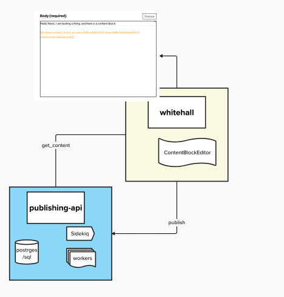
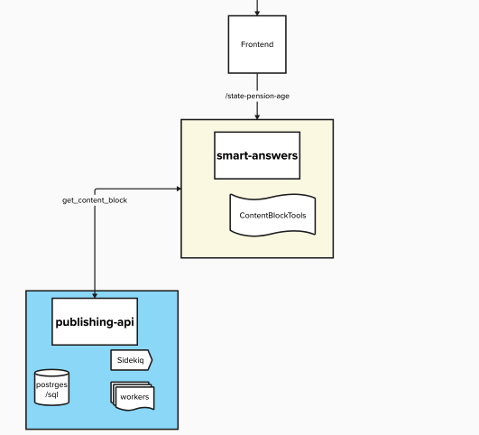
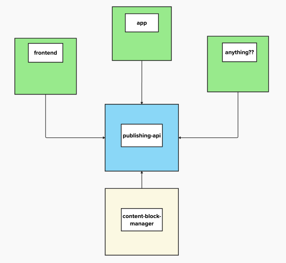

# 2. Content Blocks API - Proposal for rendering Content Blocks outside of Documents

Date: 2025-04-23

## Context

The Content Block Manager is a service that allows discrete pieces of content (Content Blocks) to be embedded into 
GOV.UK documents, via an embed code. This enables consistent reuse, and edit-once-update-everywhere behaviour. 

To use a Block, a user has to navigate to the CBM frontend to find the Block they want to use, copy an embed code, and 
then navigate back to their Document in a publisher app to copy/paste the code into the edit form. That embed code is then 
transformed in the Publishing API [via Link expansion](https://github.com/alphagov/publishing-api/blob/3bce2da44188a6ca9acd71c91b5eaf4cb9793aaa/app/services/embedded_content_finder_service.rb#L1) 
and presentation logic, and the [raw HTML value sent to content store](https://github.com/alphagov/publishing-api/blob/17f7b8cefd6c655ac0966e6483153b369da59590/app/presenters/content_embed_presenter.rb#L24).

There is currently no way for a content editor to view Content Blocks or their metadata outside of Content Block 
Manager (except when being previewed/rendered within a Host Document).

In order to scale the impact of these blocks, they need to be the source of truth for the “fact” they represent 
across any service where that fact is referenced, so they need to be visible to other apps outside of Content Block 
Manager. There are two parts to this:

### 1. Find:
When a publisher or content editor wants to know what Blocks are available and any metadata about them, we would like 
them to be able to do that “in place” rather than having to go to the CBM in another tab. In the first instance, an 
Editor creating a new Host Document should be able to search for the Block they want without leaving that Host 
Document.

### 2. Insert:
When a user has chosen a block and wants to render the value, we should allow that from any app. Whether that’s a 
Smart Answer about the State Pension, or a form in the App, or even part of the Chat LLM. This could be either 
following on from the Find journey, or its own action, for example by a developer directly in code.

**TLDR: We want to start using the Publishing API as our source of truth for Content Block Manager, and to 
potentially open up the Publishing API to consumers outside of Publisher apps. [Skip to ‘Decision’](#decision) to 
see more detail, or read on to see the options we considered.**

## Options considered

### Create a standalone Content Block API

Currently the CBM repo sits within an engine within Whitehall. Is it time for the app to become its own repo, with
its own database as a source of truth?

Pros:
* We could start building it with only the needs of CBM in mind, without treading on Publishing API or Whitehall code.
* We’d have full control over endpoint authentication/authorization and the shape of the API contract
* We could build it as consumer-agnostic as possible from the beginning
* Clear code ownership and team responsibility

Cons:
* Another microservice! with all its potential drawbacks of maintainability, might be left to degrade if our team
changes or the department’s priorities shift.
* It would not fit with the wider vision for government architecture - we don’t need yet another source of truth for
content

Another option similar to this could be that we have a mini API that proxies the Publishing API, but only gives us 
access to the data we need and returns it in the format we want. This would reduce the duplication on each individual 
application, but would also have the same drawbacks as our own microservices and its own complications.

### Directly call either Content Store or Search API

According to the lore of the Publishing ecosystem - either the Content Store or the Search API should be the
front-facing app for our content. These are queried by the frontend and contain the definitive content for our 
citizen users. There’s a few issues with this approach for Content Blocks:
* The Content Store is designed to return one Document at a base path, it’s not quite the API we might need to 
  return  e.g. lists of Blocks of a certain type, or containing a certain word.
* Content Blocks aren’t public-facing. They don’t currently have base paths so they are not published to the Content 
  Store, because they aren’t designed to be treated like published Editions - they could have metadata on them like 
  Instructions to Publishers that we might not want seen out of context in the public eye. They also aren’t designed 
  to exist on their own without the context of being embedded in a Host Document.
If implemented, we'd have to add CORS headers to call the endpoints from the client side. 

### Use Publishing API as the source of truth

We could use the existing endpoints on Publishing API, e.g. `get_content`, to get our published Content Blocks from
outside of the publishing ecosystem.

Pros:
* Publishing API is already the source of truth, no extra backend work needed as we can keep existing publishing 
  pipelines.
* We’d use existing endpoints initially e.g. calling `Services.publishing_api.get_content`
* This potentially aligns with a future GraphQL-powered use of the Publishing API as a frontend-facing app.

Cons:
* If we did open up the Publishing API to be queried externally, we'd have to be very careful about how we go about 
  changing this. Although the precedent and the vision for this has already been started by the GraphQL work, which has opened up an endpoint to be queried directly by frontend.
* We’d potentially need custom code in each service to call the API from backend (as there is no public endpoint to call Publishing API directly from the client side).

## Spike code / example use cases

### Visual editor within a publisher

You can see our work using a custom library to layer a more visual way of inserting content blocks onto [the Whitehall
editor here.](https://github.com/alphagov/whitehall/compare/main...content-modelling/use-content-block-editor)

### Smart Answers

[In this spike](https://github.com/alphagov/smart-answers/pull/7168) we show how adding a service/api layer to get Content Blocks from the Publishing API’s get_content 
endpoint.

## Decision

We’d like to move forward with the agreement that **Publishing API will be the source of truth for Content Blocks**, 
and we could hypothetically in the future call the API from any `alphagov` backend, with the potential to 
experiment with client-side requests.

As a first step, we’ll be looking at the editor experience for Content Blocks, in Whitehall or Mainstream, and look 
to introduce something like the spike sketches out with a call to Publishing API’s `get_content` endpoint.

If/when we want to bring in other channels we could revisit how the API is designed.

There’s still a lot of open questions about the implementation, which we would seek to flesh out as we come across 
concrete use cases, like:
* The load on API and performance - In a world where Publishing API is serving API requests to more services, including 
  frontends, incidents caused by publishing will be more likely to affect the user experience, and we will need to 
  mitigate this risk.
* What the developer experience/API contract would look like
* Any auth issues with opening up the API
* Whether the work on GraphQL catches up to our implementation - in which case we could use GraphQL to query for Blocks.

