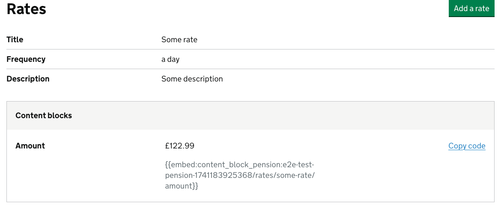
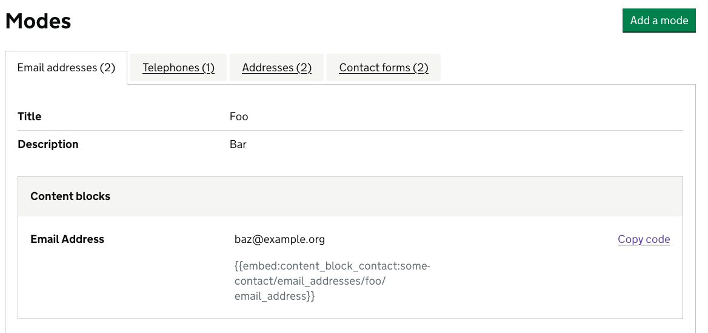
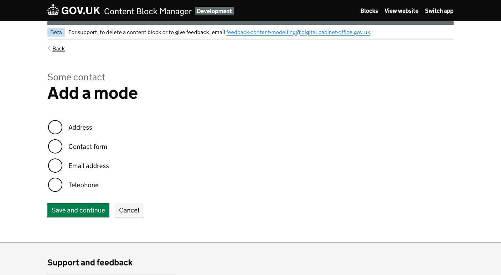
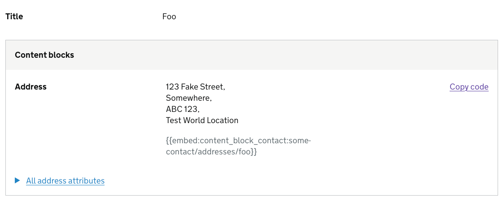
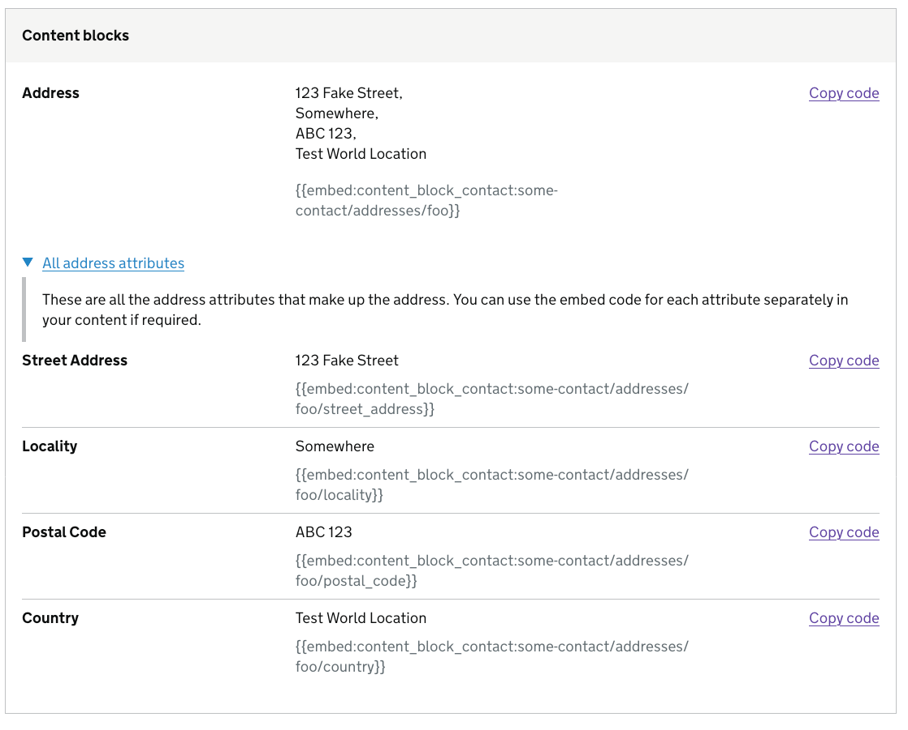

# Configuration

There is a config file within Content Block Manager, which allows us to configure how schemas and subschemas are
handled and presented. The schema is defined as follows:

## `schemas`

Made up of one or more schemas, as defined by [`schemas.<schema_name>`](#schemasschema_name)

## `schemas.<schema_name>`

An object that defines a schema

## Properties

- [embeddable_as_block](#schemasschema_nameembeddable_as_block)
- [subschemas](#schemasschema_namesubschemas)

## `schemas.<schema_name>.embeddable_as_block`

This defines if a subschema is embeddable as an entire block.

## `schemas.<schema_name>.field_order`

An array of strings that defines the order in which:

- fields appear when rendering the form
- properties are listed when viewing an embedded object in a summary list

## `schemas.<schema_name>.fields`

And object that configures fields in a schema

## Properties

- [component](#schemasschema_namefieldsfield_namecomponent)
- [field_order](#schemasschema_namefieldsfield_namefield_order)
- [data_attributes](#schemasschema_namefieldsfield_namedata_attributes)

### `schemas.<schema_name>.fields.<field_name>.component`

Allows the component used for the field to be overridden. For example, when specifying:

```yaml
...
fields:
  my_field:
    component:
      boolean
...
```

The [Boolean](https://github.com/alphagov/whitehall/blob/main/lib/engines/content_block_manager/app/components/content_block_manager/content_block_edition/details/fields/boolean_component.rb) component will be used.

### `schemas.<schema_name>.fields.<field_name>.field_order`

If thew field is an array of objects, specifies an array of strings that defines the order that fields appear in when 
rendering the subfields that can be contained in that field.

### `schemas.<schema_name>.fields.<field_name>.data_attributes`

A key/value list of data attributes to return in the HTML that surrounds the component for a given field. This is 
useful for providing Javascript modules or custom selectors.

## `schemas.<schema_name>.subschemas`

A list of [subschemas](#schemasschema_namesubschemassubschema_name) for a specific object

## `schemas.<schema_name>.subschemas.<subschema_name>`

An object that defines a subschema.

### Properties

- [embeddable_fields](#schemasschema_namesubschemassubschema_nameembeddable_fields)
- [field_order](#schemasschema_namesubschemassubschema_namefield_order)
- [group](#schemasschema_namesubschemassubschema_namegroup)
- [group_order](#schemasschema_namesubschemassubschema_namegroup_order)
- [embeddable_as_group](#schemasschema_namesubschemassubschema_nameembeddable_as_group)

## `schemas.<schema_name>.subschemas.<subschema_name>.embeddable_fields`

An array of strings that defines fields that can be embedded. This will ensure that field appears as a "Contact block"
when viewing a content block item. For example, when a subschema has the fields `freqency`, `description` and `amount`,
and only `amount` is an embeddable field, the subschema will be rendered like so:



## `schemas.<schema_name>.subschemas.<subschema_name>.field_order`

An array of strings that defines the order that fields appear in when rendering the form.

## `schemas.<schema_name>.subschemas.<subschema_name>.group`

If provided, defines the "group" a subschema appears in when viewing a contact block. For example, if a subschema is in 
a "group" called "modes" alongside other subschemas, it will be rendered like so:



There will also be a button rendered above the tabbed view, allowing the user to add an item of a particular type
within that group. Taking the example above, clicking on "Add group" will show the following screen:



## `schemas.<schema_name>.subschemas.<subschema_name>.group_order`

If provided, defines the order that a field is listed in when rendering a group.

## `schemas.<schema_name>.subschemas.<subschema_name>.embeddable_as_group`

This defines if a subschema is embeddable as a group of fields. For example, if an address has a number of fields
(street, city, postcode etc), the group embed code will embed all these fields together. Any other embeddable fields
(as defined in [`schemas.<schema_name>.subschemas.<subschema_name>.embeddable_fields`](#schemasschema_namesubschemassubschema_nameembeddable_fields))
will be shown below the group within a `details` component. For example:




