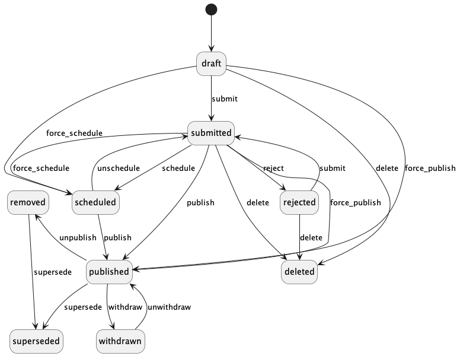
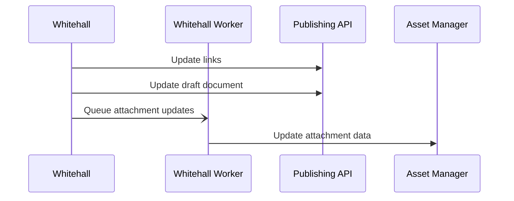
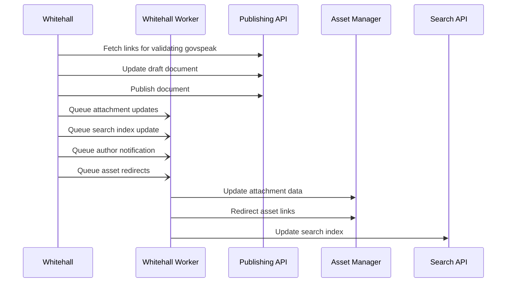

# Edition Workflow

(See also [Edition model](edition_model.md) for more on the model objects involved)

Editions will be in one of a number of states. The state machine for them is located in [workflow.rb](/app/models/edition/workflow.rb). This configures the possible transitions between states, resulting in this:

Note that a `Document` has no state, there is just state inferred by the various `Edition`s.  This diagram doesn't show the effect of multiple editions - sometimes a state transition involves superseding an existing edition and replacing it with a new one, with its own state.

## Draft

When an edition is first created, it is put into the draft state and has no content. The user then can add content and save the draft as many times as they like until they are ready to submit the document for 2i review. Whilst they are drafting the document, they can enable access limiting to make sure only colleagues from the same organisation as them can access the draft.
Each time they update the draft, Whitehall sends the data to the Publishing API and it updates the copy of the document held on the draft stack. The process looks like this:

## Submitted / Rejected

Once a draft is ready to be published, the author must submit it for 2i. Another user can either reject the draft, or publish it.

## Scheduled

A draft can be scheduled for publishing at a later date. However, if the document has not been approved by the scheduled publishing date, it will not be published.

## Published / Force Published

Once a draft has been submitted, it can be published by the person responsible for performing 2i. Once a document is published it will appear on the GOV.UK frontend.

Behind the scenes, Whitehall has to inform the Publishing API that the edition, its attachments and other associations should be published. It also has to redirect old attachment links to point to the new attachments.

## Unpublishing / Withdrawal

Some status is also controlled by the presence or otherwise of a related `Unpublishing` record. These are created during the `withdraw` and `unpublish` transitions. Editors trigger these in the [`EditionWorkflowController`](/app/controllers/admin/edition_workflow_controller.rb). The three options for Unpublishing or Withdrawing correspond to an [`UnpublishingReason`](/app/models/unpublishing_reason.rb), each of which control the behaviour of a document when visited by a user:

| ID | Name               | State         | Requires explanation? | Requires URL? | Redirects?  | Shows original content? |
|----|--------------------|---------------|-----------------------|---------------|-------------|-------------------------|
| 1  | `PublishedInError` | `unpublished` | No                    | No            | If provided | No                      |
| 4  | `Consolidated`     | `unpublished` | No                    | Yes           | Yes         | No                      |
| 5  | `Withdrawn`        | `withdrawn`   | Yes                   | No            | No          | Yes                     |

If a document has an edition in one of the `Edition::PUBLICLY_VISIBLE_STATES` (`published` or `withdrawn`), Whitehall's `DocumentsController` will render it. If an `Unpublishing` exists, the withdrawal notice will be rendered near the top of the page as well.

If a document does not have an edition in one of these states, it will use the `Unpublishing` to determine the response. If the `Unpublishing` is a redirect, ie a `Consolidated` `Unpublishing`, it will redirect to the alternative url. Otherwise it will render the `unpublished` view.

The `PublishingApiUnpublishingWorker` uses the above to decide what to do with an `Unpublishing` when sending the content to the Publishing API. It will always call the `unpublish` endpoint, with one of the following types:

| Unpublishing type                          | Publishing API unpublishing type |
|--------------------------------------------|----------------------------------|
| `PublishedInError` with alternative url    | `redirect`                       |
| `PublishedInError` without alternative url | `gone`                           |
| `PublishedInError`                         | `gone`                           |
| `Consolidated`                             | `redirect`                       |
| `Withdrawn`                                | `withdrawn`                      |

## LinkCheckerAPI

The `link-checker-api` has been integrated on the show page for Editions. It extracts all links from within any GovSpeak fields and sends them to the `/batch` endpoint of the API. In this request it also sends across a `webhook_callback` which then populates any information about broken/warning links. More reading about the endpoints can be found [here](https://docs.publishing.service.gov.uk/apis/link-checker-api.html)
