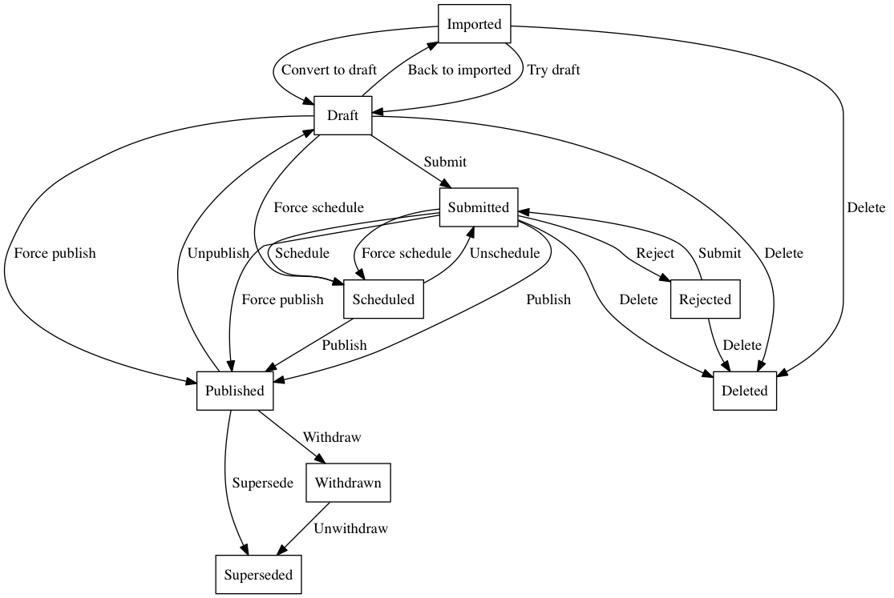

# Edition Workflow

Editions will be in one of a number of states. The state machine for them is located in [workflow.rb](/app/models/edition/workflow.rb). This configures the possible transitions between states, resulting in this:

## Unpublishing / Withdrawal

Some status is also controlled by the presence or otherwise of a related `Unpublishing` record. These are created during the `withdraw` and `unpublish` transitions. Editors trigger these in the [`EditionWorkflowController`](/app/controllers/admin/edition_workflow_controller.rb). The three options for Unpublishing or Withdrawing correspond to an [`UnpublishingReason`](/app/models/unpublishing_reason.rb), each of which control the behaviour of a document when visited by a user:

| ID | Name               | State       | Requires explanation? | Requires URL? | Redirects?  | Shows original content? |
|----|--------------------|-------------|-----------------------|---------------|-------------|-------------------------|
| 1  | `PublishedInError` | `draft`     | No                    | No            | If provided | No                      |
| 4  | `Consolidated`     | `draft`     | No                    | Yes           | Yes         | No                      |
| 5  | `Withdrawn`        | `withdrawn` | Yes                   | No            | No          | Yes                     |

If a document has an edition in one of the `Edition::PUBLICLY_VISIBLE_STATES` (`published` or `withdrawn`), Whitehall's `DocumentsController` will render it. If an `Unpublishing` exists, the withdrawal notice will be rendered near the top of the page as well.

If a document does not have an edition in one of these states, it will use the `Unpublishing` to determine the response. If the `Unpublishing` is a redirect, ie a `Consolidated` `Unpublishing`, it will redirect to the alternative url. Otherwise it will render the `unpublished` view.

The `PublishingApiUnpublishingWorker` uses the above to decide what to do with an `Unpublishing` when sending the content to the Publishing API. It will always call the `unpublish` endpoint, with one of the following types:

| Unpublishing type                          | Publishing API unpublishing type |
|--------------------------------------------|----------------------------------|
| `PublishedInError` with alternative url    | `redirect`                       |
| `PublishedInError` without alternative url | `gone`                           |
| `PublishedInError`                         | `gone`                           |
| `Consolidated`                             | `redirect`                       |
| `Withdrawn`                                | `withdrawn`                      |

## LinkCheckerAPI

The `link-checker-api` has been integrated on the show page for Editions. It extracts all links from within any GovSpeak fields and sends them to the `/batch` endpoint of the API. In this request it also sends across a `webhook_callback` which then populates any information about broken/warning links. More reading about the endpoints can be found [here](https://docs.publishing.service.gov.uk/apis/link-checker-api.html)
