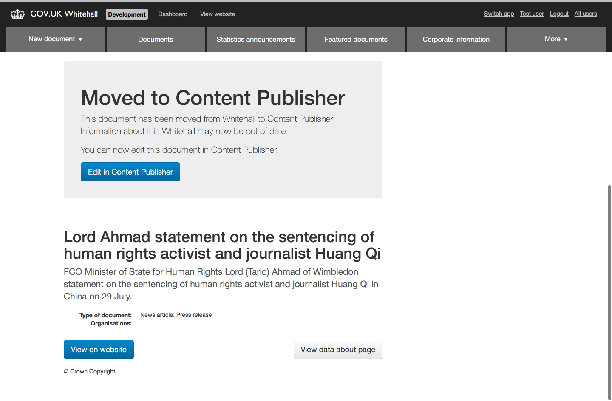
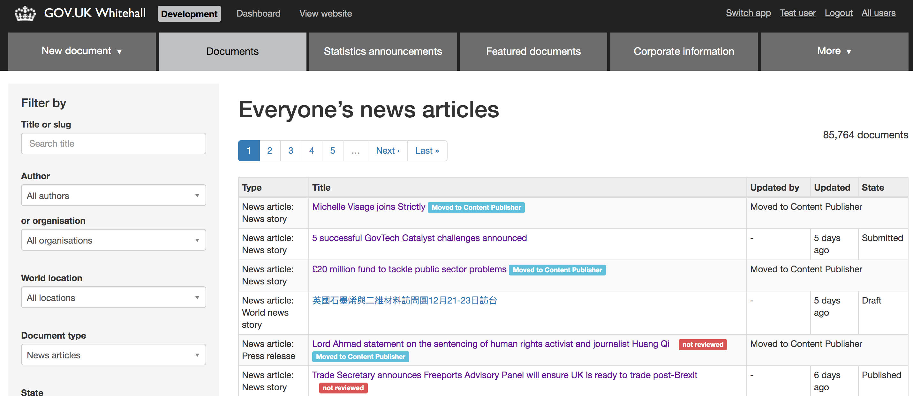
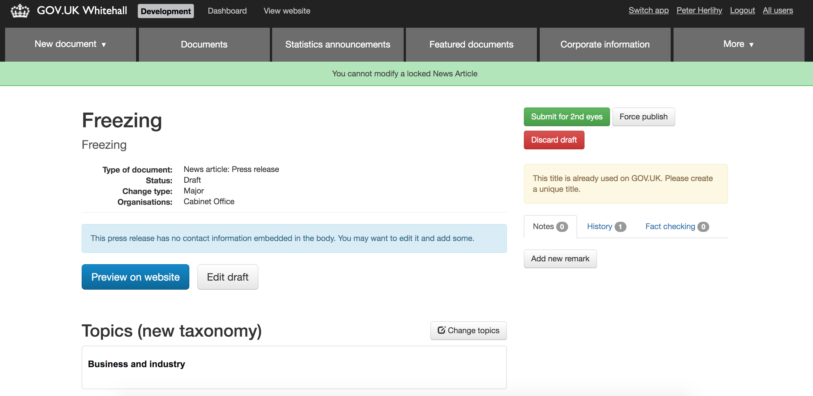

# Locked documents

The concept of a locked document was introduced by the Publishing Workflow team in July 2019 in anticipation of migrating news content from Whitehall to Content Publisher.  The intention is to prevent users from editing content that is in the process of being, or has been, migrated from Whitehall to Content Publisher by 'locking' it.  This would occur via an API call made by Content Publisher to Whitehall.

A [`locked` attribute](https://github.com/alphagov/whitehall/pull/4903) has been added to the Document model with the default set to `false`.  When this attribute is set to `true` this indicates that the document is locked and cannot be changed.  In practice this means that the document cannot be edited, workflow actions cannot be performed on it, it won't appear in certain searches within the Whitehall admin app and it won't be sent to any external APIs.  We also have the intention of storing a locked reason on the document to indicate whether it is being migrated or has been migrated.

## Changes to Whitehall

In order to prevent locked documents from being edited, we've looked at the different ways they could be edited.  These are the key places where we have introduced changes for locked documents.

### Controllers

There is a risk that users could find their way to a page to edit an edition, either through a bookmark on based on their browsing history.  To guard against this we've added a [`before_action` hook](https://github.com/alphagov/whitehall/blob/master/app/controllers/admin/editions_controller.rb#L17) to a number of controllers which checks if the document is locked before proceeding.  If the document is locked then the user is redirected to the edition show page with a message explaining that the document is locked and cannot be edited.  This hook has been applied to the Edition controller as well as to the EditionWorkflow controller and controllers for the various associations that an edition has, such as attachments.  See [this PR](https://github.com/alphagov/whitehall/pull/4954) for more details.

### Database

There is also a low level check to prevent the modification of locked documents and related entities. This is in the form of an [ActiveRecord callback](https://github.com/alphagov/whitehall/pull/4936) that will cause an exception if they are edited.  It was obvious this check should apply to the `Edition` and `Document` models, but since it has a large number of associations we needed to consider whether the check should apply to those models as well.  We determined that it would be excessive to introduce this check for every possible model, given it is unlikely these are edited in isolation.  However we identified that it would be very problematic if a locked document was featured or added to a document collection, so we've included the check in the `Feature` and `DocumentCollectionGroupMembership` models too.

### External API calls

We identified a particular issue that storing out-of-date content in Whitehall's database offers a risk that some tasks, such as mass republishing, could lead to out of date information being sent to the Publishing API, Search API or Asset Manager.  Therefore we [added checks](https://github.com/alphagov/whitehall/pull/4930) to prevent this content being sent to these GOV.UK APIs.  In some cases, such as Publishing API, Whitehall makes calls from many different places in the application so we have made a best effort to identify the key areas.

### Featured documents

Users can choose to feature a document on an organisation, world location or topical event page.  Currently only documents from Whitehall's own database can be featured and once a document has been migrated to Content Publisher then the link to this document will become out of sync and may break.  The initial plan is to replace existing featured links to migrated documents with an external link.  However we want to prevent locked documents from being able to be featured at all so that we don't have to periodically replace links.  In [this PR](https://github.com/alphagov/whitehall/pull/4920) we adapted the `Admin::EditionFilter` to exclude locked documents from the filter results by default so that they don't appear in the list of documents to be featured.

### Document collections

Users are able to add documents created in Whitehall to a document collection.  Once a document is migrated to Content Publisher then links to it from a document collection will become out of sync and may break.  We want to prevent locked documents from being able to be added to a document collection once they're migrated to Content Publisher, so in [this PR](https://github.com/alphagov/whitehall/pull/4924) we changed the scope of the editions that appear when a user searches for a document to add to the collection to exclude locked documents.

## Impact on users

Users will have a different experience when interacting with a locked document compared with a regular document.

### Edition show page

When viewing the show page for a locked document users will see a very stripped down page compared with the regular show page.  All buttons and links to edit the edition and its associations, as well as any workflow actions such as submitting for 2i, have been removed.  We've restricted the metadata that is displayed as it could quickly become out of sync with changes made in Content Publisher, which would be misleading to users.  A notice is also displayed to communicate that the document has been moved to Content Publisher and provide a link to edit the document in the app.

### Document index page

While we wanted to prevent locked documents from appearing in lists of documents to feature or add to a document collection, we do still want users to be able to access the show pages for locked documents.  We've ensured that locked documents can still be found on the document index page by adding a flag to the `Admin::EditionFilter` to include locked documents.  We've added a "Migrated to Content Publisher" label to locked documents that appear on the index page and have replaced the "Updated by", "Updated" and "State" cells with a "Migrated to Content Publisher" message to prevent confusion when these values become out of sync with changes made to the document in Content Publisher.

### Accessing edit pages

As described in the [Controllers](#controllers) section, if a user accesses a page to edit an edition or its associations directly then they will be redirected to to the document show page with a message explaining that the document is locked and cannot be edited.

