# Whitehall page transition & style guide

## First PR
Do these steps first in order to unblock any future work on pages in the section. 

Duplicate in the same `$DIR` and append legacy to the start for the following:
- `$PAGE` you're working on E.G `index.html.erb`
- Any partials it uses E.G `form.html.erb`
- `$CONTROLLER_TEST` E.G `whitehall/test/functional/admin/governments_controller_test.rb`
 
Add the following into `$CONTROLLER_TEST`:
```rb
login_as_preview_design_system_user(:gds_editor)		
```

Add the following into `$CONTROLLER`:
```rb
layout :get_layout

def $PAGE
render_design_system("$PAGE", "legacy_$PAGE", next_release: false)
# Other logic if needed
end

def get_layout
    design_system_actions += %w[$PAGE] if preview_design_system?(next_release: false)
# add any further pages into the preview in the array %w[$PAGE $PAGE2 $PAGE3]
    if design_system_actions.include?(action_name)
      "design_system"
    else
      "admin"
    end
```

# Devflow

## Branch 
All work should be added via Branches and PRs.
Branch name style. 

`move_$PAGE_from_bootstrap_to_gds`

## Commits 
Commits should be squashed/Fixed into a single commit per group. E.G. All work relating to one page in a commit

### Commit message style
Follow this general commit message style

```md
Move `PAGE` to GDS Design System

* # What
* Duplicated `PAGE` and renamed to legacy_`PAGE`
* Duplicated `CONTROLLER` and renamed to legacy_`CONTROLLER`
* Updated `PAGE` to use GDS components
* Added render_design_system feature flag to `CONTROLLER`
* Added login_as_preview_design_system_user to `CONTROLLER`
* # Why
* Align `PAGE` with the GDS Design System
* # Trello
* `LINK`
```
# Moving the page to GDS

## Where are Components?
Local - http://whitehall-admin.dev.gov.uk/component-guide
This is made from the component and can be run as a separate webpage but I think it's linked to the Database of components used
  
  Note: For Whitehall only components such as datetimefields you can find them by appending the local url such as http://whitehall-admin.dev.gov.uk/component-guide/datetime_fields

Online Website - https://components.publishing.service.gov.uk/component-guide
Doesn't require Whitehall running, doesn't have Whitehall components

## Style guide

----
### Gird & Two Thirds row 
Nearly every page should be wrapped in the `grid` and `two thirds` div
Old:
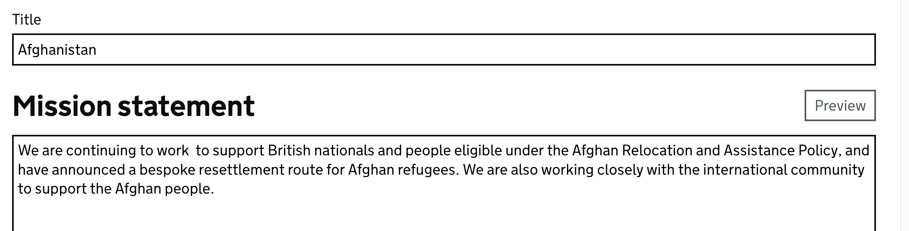
New:
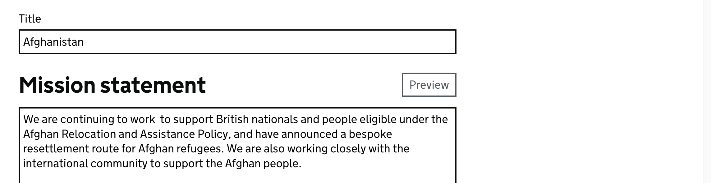
Code:
```html
<!-- Content for rbs -->
<div class="govuk-grid-row">
    <div class="govuk-grid-column-two-thirds">
      <!-- WHOLE PAGE -->
    </div>
</div>
```

---
### Field-sets
Don't use these anymore, separate them into components (input, checkbox) copy warnings etc. If these are wrapped in form_for tags you will need to copy them for usability. 
Old:
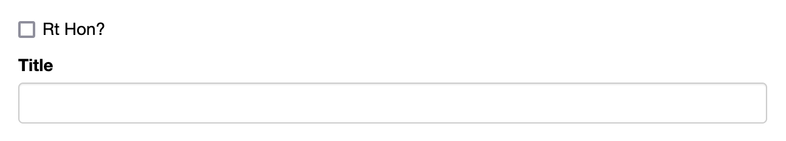
New:
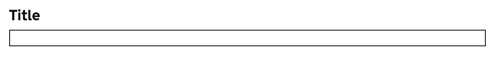
Code:
https://components.publishing.service.gov.uk/component-guide/input

---
### Warnings
Warnings should be in **black**. Do not use `hightlighted_text` as we don't want <span style="color:red">red</span> the word 'Warning:' should be removed from the string
Old:

New:

Code:
https://components.publishing.service.gov.uk/component-guide/warning_text

---
### Tabs secondary navigation
Old:
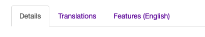
New:

Code:
```ruby
    <%= render "components/secondary_navigation", {
      aria_label: "Document navigation tabs",
      items: secondary_navigation_tabs_items(current_user, @PAGE_INSTANCE, request.path)
    } %>
```
----
### Creation buttons
for a button that creates something you should use the <span style="color:green">green button</span>
the text for the button should follow the pattern `Create New $VAR`
Old:

New:
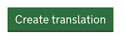
Code:
https://components.publishing.service.gov.uk/component-guide/button

---
### Edit or other
edit, update, back etc should use the <span style="color:grey">grey secondary button</span>
Old:
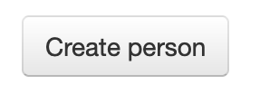
New:
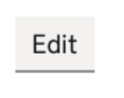
Code:
https://components.publishing.service.gov.uk/component-guide/button#secondary_solid_button

---
### Save and Cancel joint button
<span style="color:green">green button</span> and a `cancel` link wrapped in a div tag
Old:

New:

Code:
```html
<div class="govuk-button-group">  
  <%= render "govuk_publishing_components/components/button", {  
    text: "Save"  
  } %>  
  <%= link_to("cancel", $FIELD_MODEL_path(), class: "govuk-link") %> 
</div>
```

---
### Remove/Delete
Destructive (Delete/Remove) buttons should be <span style="color:red">red</span>
Old:
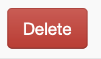
New:


Code:
https://components.publishing.service.gov.uk/component-guide/button#destructive_button

For destructive links append the following class:
```ruby
class='govuk-link gem-link--destructive
```

----
## Tables 
Ideally titles should not be linked instead (view) should be added next to the title edit/delete at the end as its more explicit. They should also be wrapped with sanatize if there is multiple entries so screenreaders will feedback $TITLE_edit. For squashing the action into one column the `Actions` Col should have `numeric` format
Old:

New:
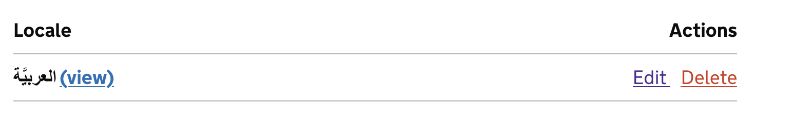
Code:
```ruby
<%= render "govuk_publishing_components/components/table", {
  first_cell_is_header: $BOOL # (TRUE) if titles are bolded
  head: [
    {
      text: $STRING_TITLE_TEXT # E.G "Locale"
    },
    {
      text: $STRING_TITLE_TEXT_TWO # E.G "Actions",
      format: $STRING_FORMAT # "numeric"
    }
  ],
  rows:
  # Logic if needed E.G $@INSTANCE.VALUE.map do |$VAR|
      [
        {
          text: sanitize("#{$VAR.VALUE} " + link_to("(view)", $@INSTANCE
            .public_url($PARAM: $VAR.VALUE), class: "govuk-link")) # This adds (view) next to the title 
        },
        {
          # The NAME_VALUE is the value that will be show appened with edit for example locale.native_language will show 'Edit Afrikans` 
          text: sanitize("<a class='govuk-link' href='#{$EDIT_PATH($@INSTANCE, $VAR.VALUE)}'>Edit <span class='govuk-visually-hidden'>#{$VAR.NAME_VALUE}</span></a>" +
                            "<a class='govuk-link gem-link--destructive govuk-!-margin-left-2'
                            href='#{$DESTROY_PATH($@INSTANCE, $VAR.VALUE)}'>Delete <span
                            class='govuk-visually-hidden'>#{$VAR.NAME_VALUE}</span></a>"),
          format: "numeric" # is needed for these right aligned table styles
        }
      ]
    end
} %>
```


---
## Titles
Old:

New:

Code:
https://components.publishing.service.gov.uk/component-guide/title

---
## Titles with context
Titles that are nested should have a context protitle
Old:

New:

Code:
https://components.publishing.service.gov.uk/component-guide/title#with_context_inside

OR at the top of the page

```ruby
<% content_for :context, "$NESTED_MODEL" %>
```

---
## Text area with preview or Govspeak
Old:
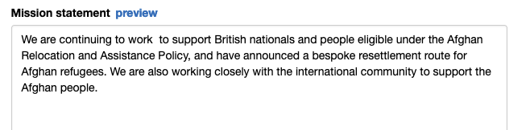
New:
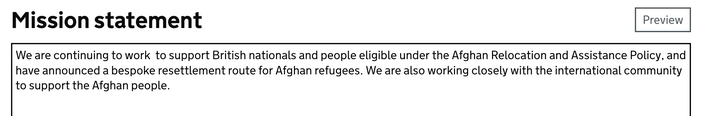
Code:
```ruby
  <%= render "components/govspeak-editor", {
    label: {
      text: "$LABEL_TEXT",
      heading_size: "l",
    },
    name: "$VIEW_AS_KEY[$VALUE]", #E.G world_location_news[mission_statement]
    id: "$EXSISTING_ID", #E.G world_location_news_mission_statement from inspect on Intergration
    value: $@INSTACE.VALUE, #E.G @world_location_news.mission_statement
    rows: $INT_SIZE,
    data_mod: {
      module: "paste-html-to-govspeak"
    }
  } %>
```

---
## Text Input
Should be wrapped in [Two Thirds Div](#gird--two-thirds-row). Heading size should always be `l`, only pages with many fields should use `m` or smaller.
Old:
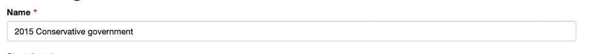
New:

Code:
https://components.publishing.service.gov.uk/component-guide/input

---
## Select / Dropdown
Should be wrapped in [Two Thirds Div](#gird--two-thirds-row).
Old:
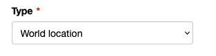
New:
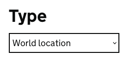
Code:
https://components.publishing.service.gov.uk/component-guide/select

---
## Datetimefields
Heading size should always be `l`, only pages with many fields should use `m` or smaller.
Old:
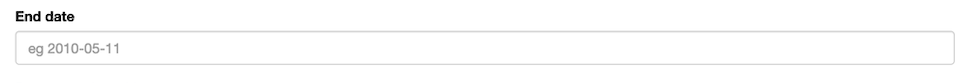
New:
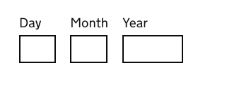
Code:
```ruby
<%= render "components/datetime_fields", {
        date_only: $BOOL, # Whether it adds a time entry (FALSE) or not (TRUE)
        prefix: $STRING_PREFIX # "government",
        field_name: $STRING_NAME # "start_date",
        id: $STRING_ID # "government_start_date" ID from Intergration
        heading_size: "l", # xl,l,m,s,xs
        date_hint: $STRING_HINT # E.g "For example, 01 August 2015",
        date_heading: $STRING_HEADING # E.G "Start date"

        year: {
          value: $INSTANCE.VALUE # government.start_date.to_date,
          start_year: $INT_YEAR # 1800
        },
        month: {
          value: $INSTANCE.VALUE # government.start_date.to_date,
        },
        day: {
          value: $INSTANCE.VALUE # government.start_date.to_date,
        },

        error_items: errors_for_input($INSTANCE.errors, :start_date)
      } %>
```

---
## Inset warnings & `no content border`
For warnings where a table would not be generated, or there has been no content found you should add an `inset warning`
Old:
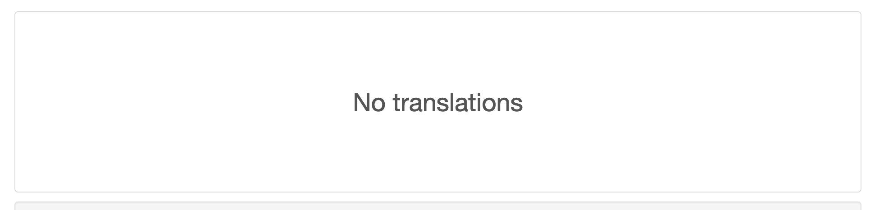
New:

Code:
```ruby
<%= render "components/inset_prompt",{
  description: $STRING_DESC
}>
```

---
## View on website link
View on website links should always open to a new tab, if under a title the title should have spacing underneath. Links should have spacing below. 
Old:
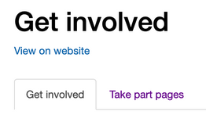
New:
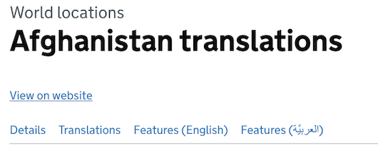
Code:
```ruby
<% content_for :title_margin_bottom, 4 %>
  <p class="govuk-body">
    <%= link_to "View on website", $@INSTANCE.public_url(cachebust_url_options), class: "govuk-link", target: "_blank" %>
  </p>
```

---